# AtomicMotion UI

[](https://github.com/michellesijiama/atomicmotion-ui/actions/workflows/ci.yml)

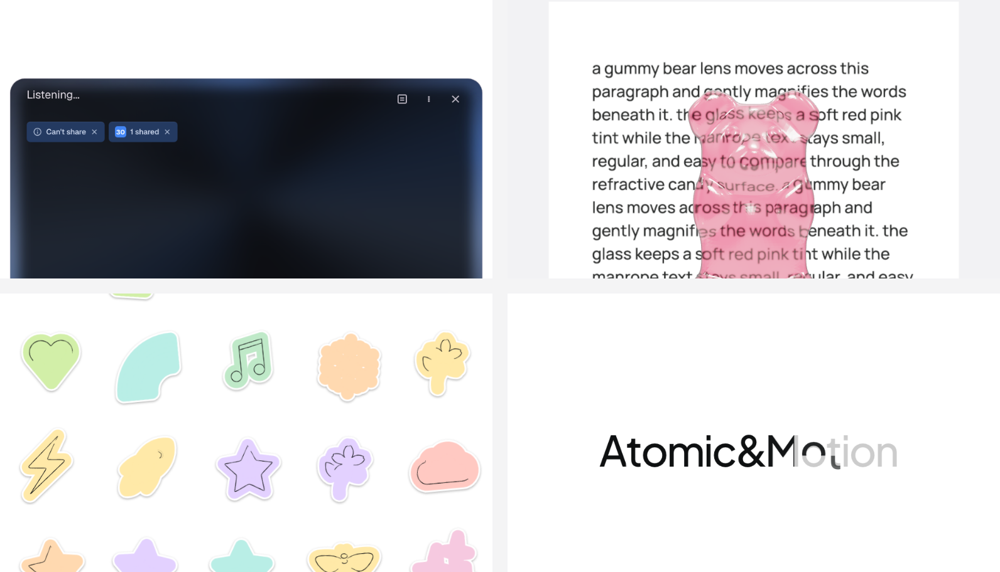

Open-source micro-interactions for designers and developers — a gallery of
polished, animated UI components you can lift into your own project one file at
a time.

**Live gallery → [atomicmotion.dev](https://atomicmotion.dev)**

Clone the repo and run commands from the repo root — see
[Local development](#local-development) below.

Each interaction keeps its component code in a single file. Browse it in the
gallery, then copy the source (or hand an AI agent a ready-made prompt) and
drop it into your codebase. Components that load runtime assets call those
files and their licence requirements out explicitly.

## What this is / what this isn't

- **This is** a copy-paste component gallery: each file in `components/`
  is meant to be pulled into your own project and adapted.
- **This isn't** an npm package — there's nothing to `npm install` from this
  repo, and no semver or API-stability guarantee across commits.
- The gallery site (`atomicmotion.dev`) is a demo of the components, not a
  supported hosted product — issues about the site itself are welcome, but
  it isn't maintained as a service.

## Components

| Preview | Component | Category | Inspired by | Source |
| --- | --- | --- | --- | --- |
| 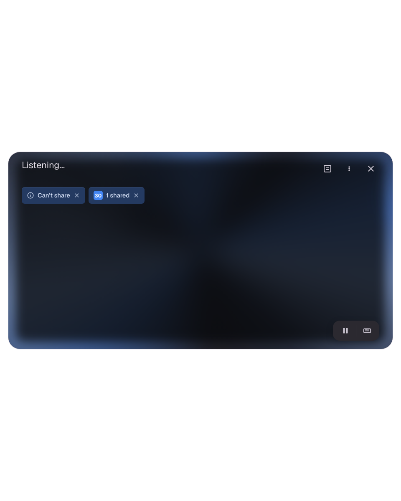 | **Gemini Live** — floating live-assistant panel with source chips, a blue edge glow, and listening pulses | AI | [Gemini](https://gemini.google.com) | [`gemini-live.tsx`](components/ai/gemini-live/gemini-live.tsx) |
| 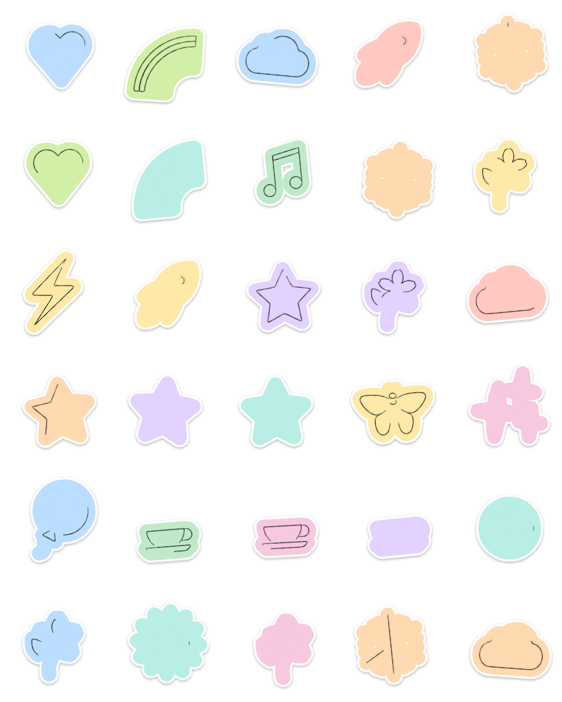 | **Emoji Sketch** — pick an emoji and watch it self-draw stroke by stroke, with a pencil wobble | Tool | [Getty × Gehry](https://gehry.getty.edu) | [`emoji-sketch.tsx`](components/tool/emoji-sketch/emoji-sketch.tsx) |
| 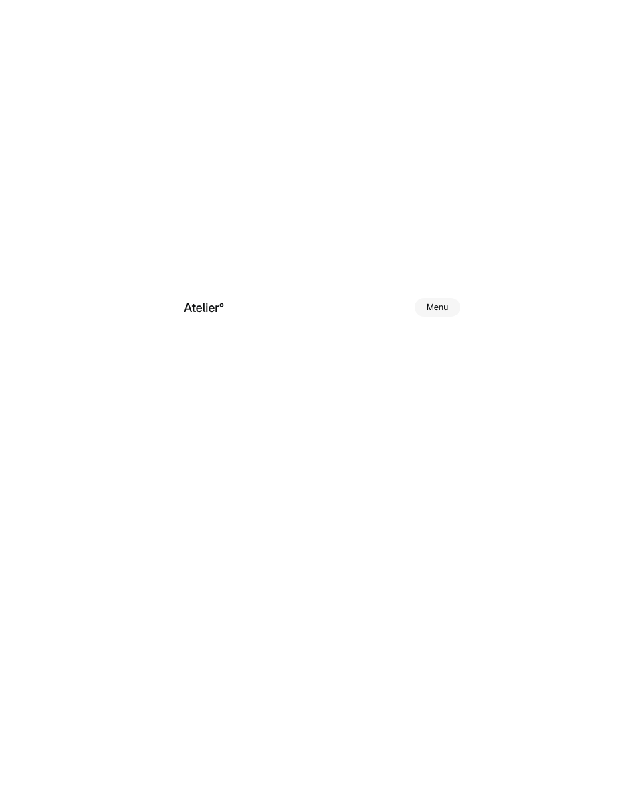 | **Soft Menu Reveal** — a frosted menu that unfolds from a stable nav row on a bell-curve transition | Navigation | [Jitter](https://madewithjitter.com) | [`soft-menu-reveal.tsx`](components/navigation/soft-menu-reveal/soft-menu-reveal.tsx) |
| 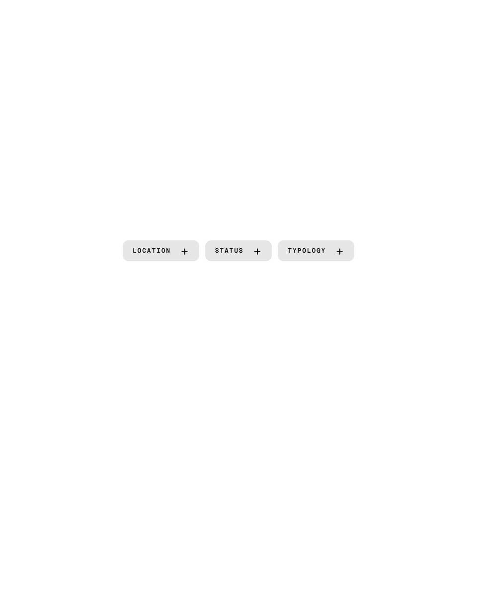 | **Filter Dropdown Reveal** — a project filter bar with a soft dropdown and clipped text reveal | Navigation | [MAD](https://www.i-mad.com) | [`filter-dropdown-reveal.tsx`](components/navigation/filter-dropdown-reveal/filter-dropdown-reveal.tsx) |
| 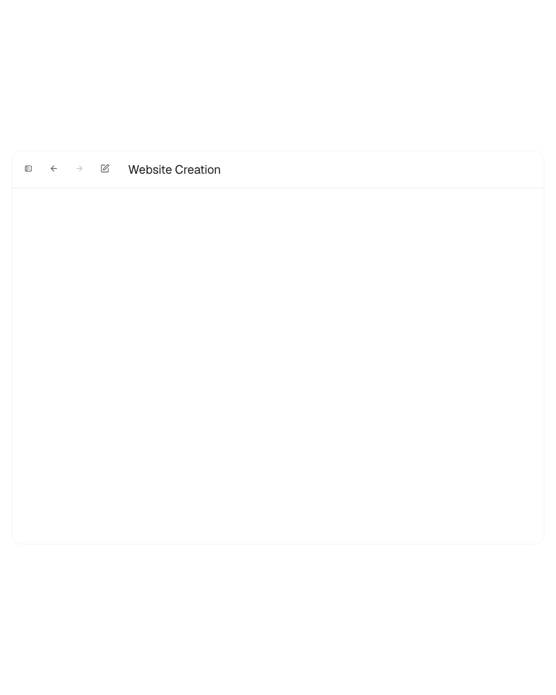 | **Codex Sidebar Reveal** — a compact app shell whose left sidebar expands and shifts the workspace | Navigation | [Codex](https://openai.com/codex) | [`codex-sidebar-reveal.tsx`](components/navigation/codex-sidebar-reveal/codex-sidebar-reveal.tsx) |
| 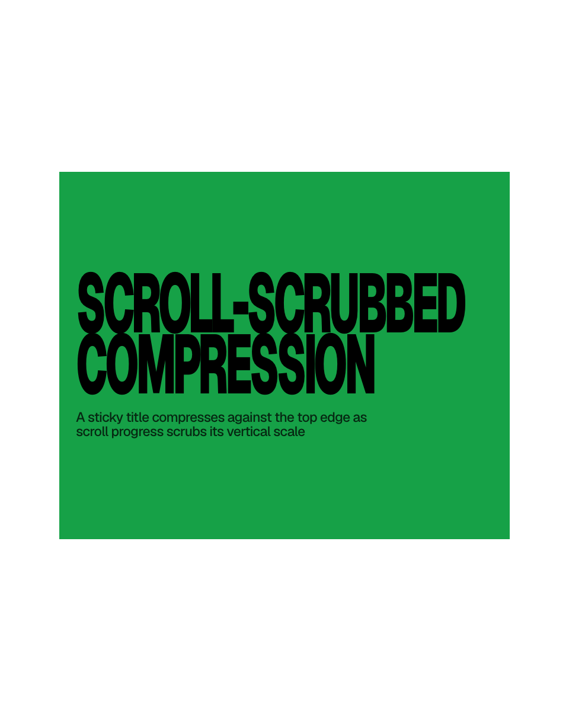 | **Scroll-Scrubbed Typography** — a sticky editorial title that stretches tall, then compresses as scroll scrubs its scale | Typography | [Getty × Gehry](https://gehry.getty.edu) | [`scroll-scrubbed-typography.tsx`](components/typography/scroll-scrubbed-typography/scroll-scrubbed-typography.tsx) |
|  | **Geometric Logo Reveal** — a wordmark assembles from a gray ghost into solid ink in a staggered cascade | Typography | [Form&Fun](https://www.formandfun.co) | [`geometric-logo-reveal.tsx`](components/typography/geometric-logo-reveal/geometric-logo-reveal.tsx) |
| 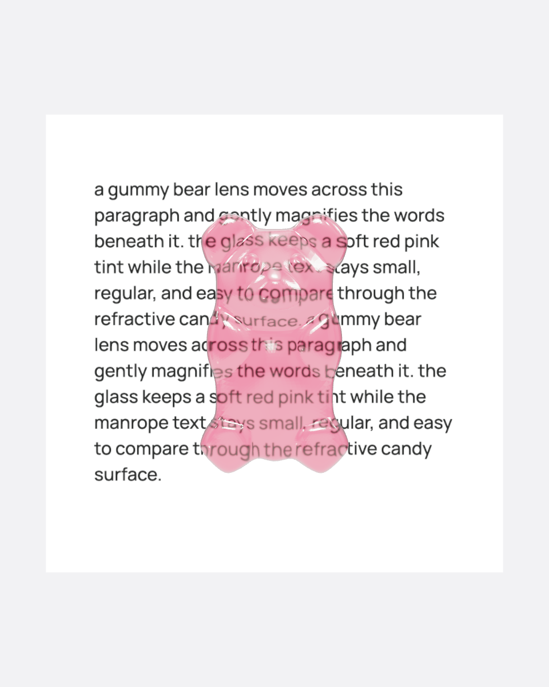 | **Gradient Gummy Bear** — a translucent 3D gummy bear (Three.js) with a soft pink gradient and cursor parallax | 3D | — | [`gradient-gummy-bear.tsx`](components/3d/gradient-gummy-bear/gradient-gummy-bear.tsx) |
| 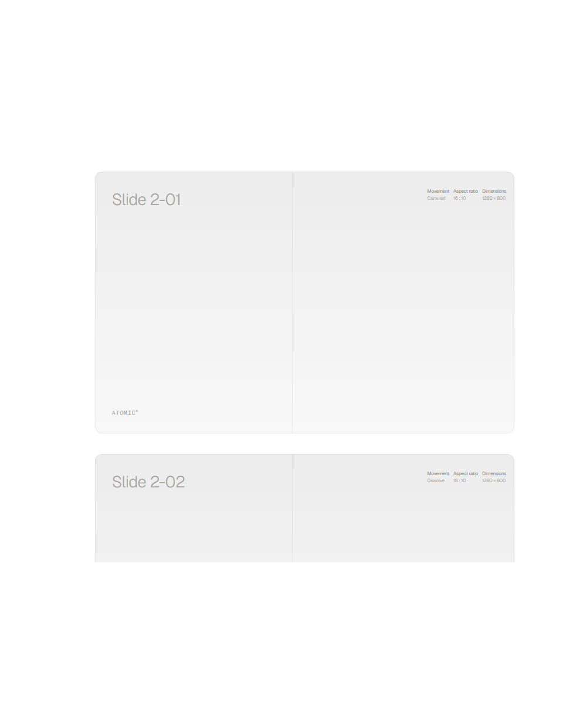 | **Scroll Phase Cursor** — a circular pointer whose ring fills with page progress while a sculpted 3D form rotates with scroll | Cursor | [Inversa](https://inversa.com) | [`scroll-phase-cursor.tsx`](components/cursor/scroll-phase-cursor/scroll-phase-cursor.tsx) |
| 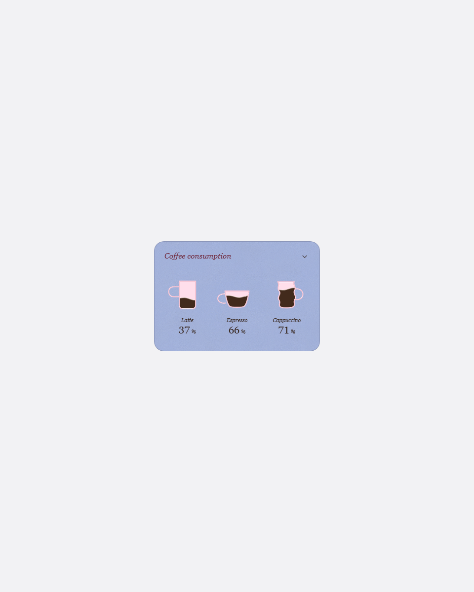 | **Coffee Gauge** — three hand-drawn cups that pour and drain as liquid gauges; open the card and log what you actually drank | Data | — | [`coffee-gauge.tsx`](components/data/coffee-gauge/coffee-gauge.tsx) |
| 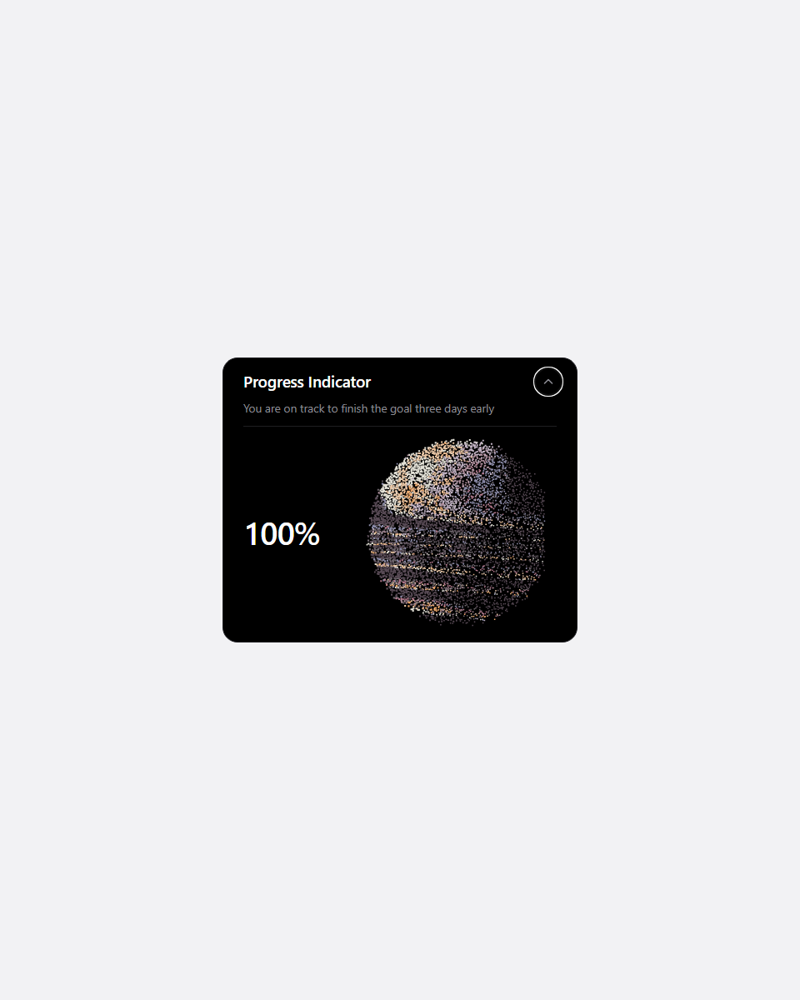 | **Halftone Bloom** — a progress indicator stippled entirely in dots: a moon that lights left to right like a terminator, new to full | Data | — | [`halftone-bloom.tsx`](components/data/halftone-bloom/halftone-bloom.tsx) |

## Using a component

Every component is designed for **copy-paste distribution** — there is no npm
package to install. On each component's page in the [gallery](https://atomicmotion.dev)
you get two actions:

- **Copy link** — the GitHub URL of that component's source file.
- **Copy for AI** — a prompt you can paste into an AI coding agent (Claude Code,
  Cursor, etc.) telling it where the source lives, which dependencies to add,
  and to adapt it into your project.

To add one by hand (using Gemini Live as an example):

1. Open the component folder and follow its generated `README.md`; it lists the
   exact dependencies and any required runtime assets.
2. Copy the component's `.tsx` file into your project, preserving any required
   assets and attribution listed in that README.
3. Install the listed dependencies. For Gemini Live:
   ```bash
   npm install framer-motion clsx tailwind-merge
   ```
4. Import and render it:
   ```tsx
   import { GeminiLive } from "@/components/ai/gemini-live/gemini-live";

   export function Demo() {
     return <GeminiLive />;
   }
   ```

Component files do not import this gallery's private `@/` modules. Dependencies
vary by interaction, and the generated README in each folder is authoritative.
Components preserve keyboard access and focus states so they stay accessible
in your app.

## Stack

- [Next.js](https://nextjs.org) (App Router)
- React + TypeScript
- [Tailwind CSS](https://tailwindcss.com) v4
- [Framer Motion](https://www.framer.com/motion/)
- [lucide-react](https://lucide.dev) icons

## Repository layout

The Next.js gallery app lives at the repo root; run all commands from there.

```
.
├─ components/                # one folder per interaction, grouped by category
│  ├─ 3d/
│  ├─ ai/
│  ├─ cursor/
│  ├─ navigation/
│  ├─ tool/
│  ├─ typography/
│  └─ unregistered/           # components not currently linked from the gallery
├─ src/
│  ├─ components/website/     # the gallery site's own chrome, not public components
│  ├─ lib/                    # registry + helpers (cn, clipboard)
│  └─ app/                    # gallery + component detail pages
├─ public/                    # previews, models, emoji art
├─ scripts/                   # guard + verify scripts
└─ docs/                      # OSS audit and asset provenance
```

## Local development

```bash
npm install
npm run dev
```

Then open <http://localhost:3000>.

Before opening a PR, verify the build:

```bash
npm run lint
npm run build
```

## Contributing

Contributions are welcome. Keep each new interaction in its own folder under
`components/<category>/`, self-contained in a single component file, and add
its entry to `src/lib/component-registry.ts` so it appears in the gallery.

## Credits

Designed and built by [Sijia Ma](https://www.linkedin.com/in/michellesijiama/).
Each component credits the site or work that inspired it.

## Third-party assets

This repo's own code is MIT-licensed, but a few binary assets under
`public/` carry different licenses or unresolved provenance.
See [`ASSETS.md`](ASSETS.md) for the full table. Notably:

- The Gradient Gummy Bear uses the "Gummy Bear" 3D model by Poly by Google
  (Google Poly), licensed [CC-BY 3.0](https://creativecommons.org/licenses/by/3.0/),
  sourced via [Poly Pizza](https://poly.pizza/m/5zl16PPAItW).
- The Emoji Sketch component's line-art SVGs are [OpenMoji](https://openmoji.org)
  v15.0.0, licensed **CC BY-SA 4.0** — see
  [`licenses/OpenMoji-CC-BY-SA-4.0.txt`](licenses/OpenMoji-CC-BY-SA-4.0.txt).

## License

[MIT](LICENSE) © 2026 Sijia Ma — scoped to this repository's original source
code. Third-party assets keep their own licenses; see
[Third-party assets](#third-party-assets) above.
